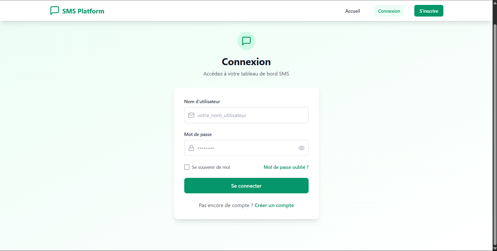
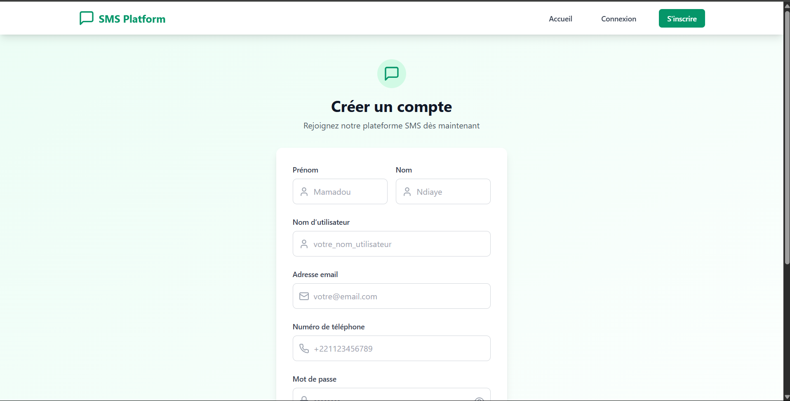
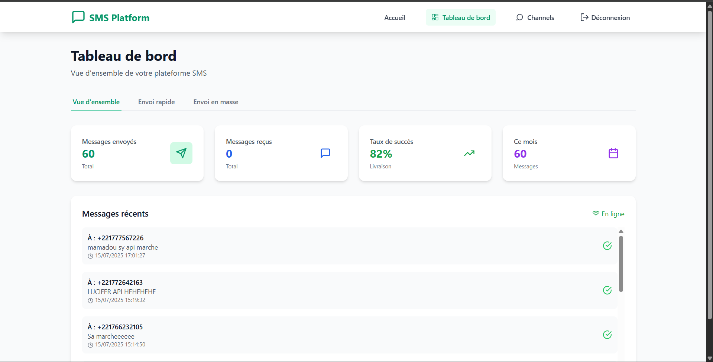
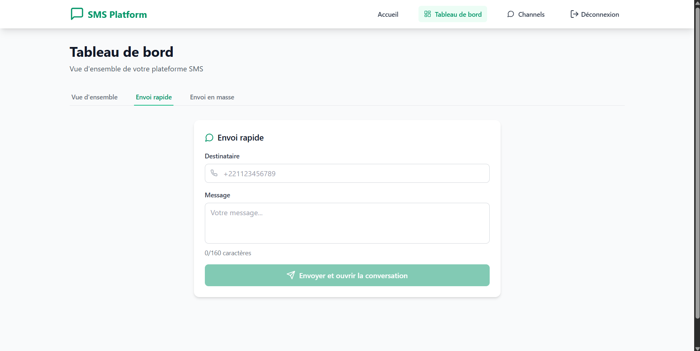
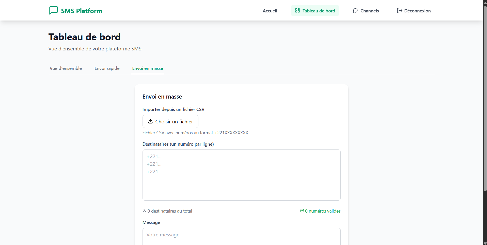
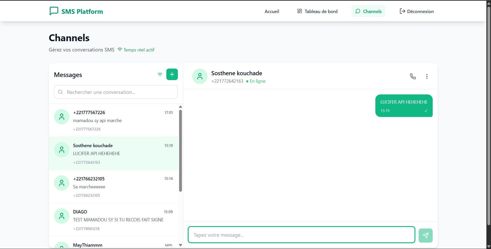
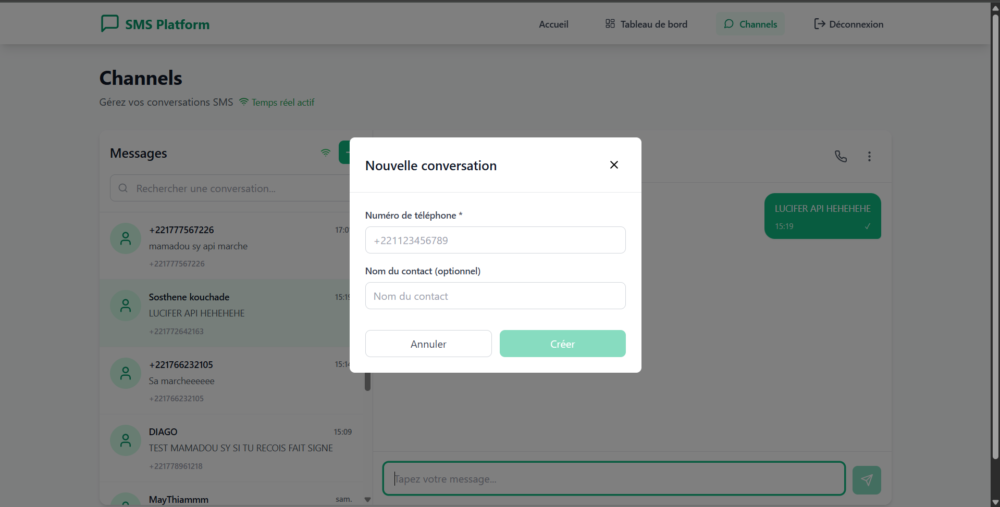

<p align="center">
  
  
  
  
</p>

# 📡 Présentation Projet SVA : SMS-PLATFORM

**Auteur** : Mamadou Sy  
**Formation** : Étudiant en 3ème année de Licence en Télécommunication, Réseau et Informatique  
**Spécialité** : Développement d’Applications Réparties  
**Établissement** : École Supérieure Multinationale des Télécommunications

---

## 📑 Sommaire

- [1. Introduction et Vision du Projet](#1-introduction-et-vision-du-projet)
- [2. Objectifs de la Plateforme](#2-objectifs-de-la-plateforme)
- [3. Architecture Technique](#3-architecture-technique)
- [4. Fonctionnement et Modules Détaillés](#4-fonctionnement-et-modules-détaillés)
  - [Module d’Authentification Utilisateur et API](#module-dauthentification-utilisateur-et-api)
  - [Module du Tableau de Bord (Dashboard)](#module-du-tableau-de-bord-dashboard)
  - [Module d’Envoi de SMS](#module-denvoi-de-sms)
  - [Module de Messagerie “Channels”](#module-de-messagerie-channels)
- [5. Sécurité et Validation des Données](#5-sécurité-et-validation-des-données)
- [6. Intégration de l’API SMS d’Orange](#6-intégration-de-lapi-sms-dorange)
- [7. Captures d’Écran de la Plateforme](#7-captures-décran-de-la-plateforme)
- [8. Installation et Lancement Technique](#8-installation-et-lancement-technique)

---

## 1. Introduction et Vision du Projet

Ce projet consiste à développer une plateforme web complète et autonome qui permet aux utilisateurs d’interagir avec le réseau SMS de manière simple et intuitive. L’objectif principal est de s’appuyer sur l’API SMS d’Orange pour construire un service capable non seulement d’envoyer des messages, mais aussi de recevoir et d’afficher les réponses en temps réel, créant ainsi une véritable expérience conversationnelle.

La plateforme centralise la gestion des communications, stocke l’historique des échanges et garantit un accès sécurisé grâce au protocole d’authentification OAuth2 fourni par Orange.

---

## 2. Objectifs de la Plateforme

- **Envoi de SMS** : Permettre aux utilisateurs d’envoyer des SMS directement depuis une interface web conviviale.
- **Réception en Temps Réel** : Mettre en place un système pour recevoir les réponses des contacts et les afficher instantanément à l’utilisateur concerné.
- **Stockage des Données** : Assurer la persistance des messages envoyés et reçus en les stockant dans une base de données robuste.
- **Intégration API** : Utiliser et maîtriser l’API SMS d’Orange comme principal vecteur de communication.
- **Sécurité et Authentification** : Gérer l’authentification sécurisée avec le protocole OAuth2 pour protéger les communications avec l’API d’Orange.
- **Interface Utilisateur** : Concevoir un tableau de bord simple, intuitif et responsive pour une expérience utilisateur optimale.

---

## 3. Architecture Technique

| Composant        | Technologies Mises en Œuvre             | Rôle dans le Projet |
|------------------|------------------------------------------|----------------------|
| **Frontend**     | React.js (avec TypeScript)               | Construction de l’interface utilisateur interactive et responsive |
| **Backend**      | Python (Django Rest Framework)           | Gestion de la logique métier, des appels API et de la communication avec la base de données |
| **Base de données** | PostgreSQL                           | Stockage des informations des utilisateurs, des conversations et des messages |
| **API Externe**  | Orange SMS API                          | Pont de communication pour l’envoi et la réception des SMS |
| **Authentification** | OAuth2 (Orange Developer Portal)     | Sécurisation des échanges entre le backend et l’API d’Orange |
| **Temps Réel**   | Django Channels & WebSockets             | Communication bidirectionnelle instantanée entre le serveur et le client |

---

## 4. Fonctionnement et Modules Détaillés

### 🔐 Module d’Authentification Utilisateur et API

Ce module est double : il gère à la fois l’accès des utilisateurs à la plateforme et l’accès de la plateforme à l’API d’Orange.

- **Authentification Utilisateur** : Un système basé sur les JSON Web Tokens (JWT) permet aux utilisateurs de s’inscrire et de se connecter. Après connexion, un token est stocké sur le client pour authentifier ses requêtes ultérieures.
- **Authentification API Orange** : Le backend gère de manière sécurisée le token OAuth2. Avant chaque envoi de SMS, il s’assure d’avoir un jeton d’accès valide pour communiquer avec l’API d’Orange, le renouvelant automatiquement si nécessaire.

### 📊 Module du Tableau de Bord (Dashboard)

C’est la page d’accueil de l’utilisateur connecté. Elle offre une vision synthétique de son activité.

- **Statistiques Clés** : Des cartes présentent des indicateurs importants calculés à partir de l’historique des messages :
  - Nombre total de messages envoyés
  - Nombre total de messages reçus
  - Le taux de succès des envois
  - Le volume de messages échangés durant le mois en cours
- **Messages Récents** : Une liste des derniers messages envoyés est affichée, permettant un suivi rapide des dernières activités.

### ✉️ Module d’Envoi de SMS

Ce module offre plusieurs méthodes pour envoyer des messages :

- **Envoi Rapide** : Un formulaire simple permet d’envoyer un message unique à un seul destinataire. Une fois le message envoyé, l’utilisateur est redirigé vers la conversation correspondante dans l’interface "Channels".
- **Envoi en Masse** : Une fonctionnalité puissante pour les campagnes de communication :
  1. **Saisie des numéros** : L’utilisateur peut coller une liste de numéros de téléphone, chacun sur une nouvelle ligne.
  2. **Import de fichier CSV** : L’utilisateur peut téléverser un fichier CSV contenant une colonne de numéros de téléphone, qui sont automatiquement extraits et validés.
  3. **Envoi** : Le backend reçoit la liste des destinataires et le message, puis envoie le SMS séquentiellement à chaque numéro valide.

### 💬 Module de Messagerie (“Channels”)

C’est le cœur de l’expérience conversationnelle de la plateforme.

- **Réception via Webhook** : Le backend expose une URL sécurisée (webhook) à l’API d’Orange. Lorsqu’un SMS est reçu sur le numéro de la plateforme, Orange appelle ce webhook, transmettant les détails du message. Le backend enregistre le SMS et le relaie à l’utilisateur concerné.
- **Interface de Chat en Temps Réel** : Grâce aux WebSockets, les messages reçus apparaissent instantanément dans la fenêtre de conversation de l’utilisateur, sans qu’il ait besoin de rafraîchir la page.
- **Création de Conversation** : Depuis la page “Channels”, l’utilisateur peut cliquer sur un bouton “+” pour ouvrir une fenêtre modale. Il peut y saisir le numéro d’un nouveau contact pour démarrer une nouvelle conversation, qui s’ajoute alors immédiatement à sa liste.
- **Historique Centralisé** : Chaque conversation affiche l’historique complet des échanges (envoyés et reçus) avec un contact donné.

---

## 5. Sécurité et Validation des Données

### ✅ Validation Frontend (Côté Client)

- **Format des Numéros** : Les champs de saisie de numéro de téléphone vérifient en temps réel que le format correspond au standard sénégalais (+221 suivi de 9 chiffres).
- **Champs Requis** : Les formulaires ne peuvent être soumis que si les champs obligatoires (destinataire, message) sont remplis.
- **Confirmation de Mot de Passe** : Lors de l’inscription, l’interface vérifie que les deux mots de passe saisis sont identiques.

### 🔐 Validation Backend (Côté Serveur)

- **Unicité des Données** : La base de données impose des contraintes strictes (numéro unique, email unique).
- **Validation des Données Entrantes** : Django Rest Framework valide le type, la longueur et le format de toutes les données reçues par l’API.

---

## 6. Intégration de l’API SMS d’Orange

L’API SMS d’Orange est une solution professionnelle qui permet d’automatiser et de personnaliser l’envoi de SMS. Elle est au cœur de ce projet.

Le processus d’intégration commence par la création d’un compte sur le portail développeur d’Orange Sonatel pour obtenir les clés d’API nécessaires. Ensuite, le backend s’occupe de sécuriser les échanges, de gérer l’authentification OAuth2 et d’exécuter les appels à l’API.

---

## 7. Captures d’Écran de la Plateforme

## Accueil
- 
## Connexion
- 
## Inscription
- 
- 
## Dashboard
- 
## Envoi Rapide SMS
  - 
## Envoi SMS en masse
  - 
  - 
## Conversation
- 
## Ajout Conversation
  - 

---

## 8. Installation et Lancement Technique

### 🔧 Prérequis

- Node.js >= 16.x
- Python >= 3.10
- PostgreSQL

### ⚙️ Installation Backend (Django)

```bash
cd backend
python -m venv env
source env/bin/activate  # ou env\Scripts\activate sous Windows
pip install -r requirements.txt
cp .env.example .env  # ajoute tes clés API Orange et paramètres DB
python manage.py migrate
python manage.py runserver
```

### ⚙️ Installation Frontend (React)

```bash
cd frontend
npm install
cp .env.example .env  # configure l’URL du backend
npm run dev  # ou npm start
```

### 🧪 Tests (optionnel)

```bash
python manage.py test  # backend
npm run test            # frontend
```

---

© Mamadou Sy — Projet SVA — ESMT 2025
